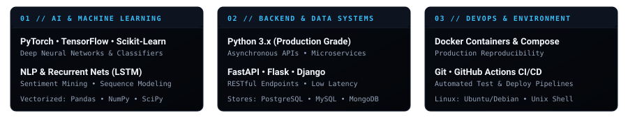
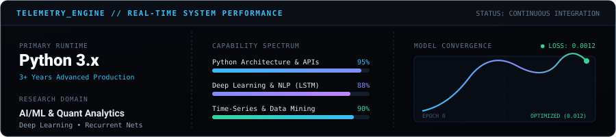

<div align="center">

<!-- ===================================================================== -->
<!-- 1. MASTER COMMAND DECK & HERO MASTHEAD                                -->
<!-- ===================================================================== -->



<br/><br/>

<!-- ===================================================================== -->
<!-- 2. HIGH-PRECISION RUNTIME STATUS STRIP                                -->
<!-- ===================================================================== -->


<br/>


</div>

<!-- ===================================================================== -->
<!-- 3. ARCHITECTURAL DOSSIER // SYSTEM SPECIFICATIONS                    -->
<!-- ===================================================================== -->

### `SYSTEM_OVERVIEW` // CORE ARCHITECTURE

```yaml
architect:
  name: "Utkarsh Manoj Pandey"
  designation: "Artificial Intelligence & Data Systems Architect"
  alumnus: "Meta Scifor Technologies"
  location: "Mumbai, India (Global Remote Capable)"
  status: "Active // Engineering Resilient AI & Quantitative Pipelines"

engineering_ethos:
  philosophy: "Transforming stochastic real-world data into high-precision algorithmic value."
  discipline: "Clean, vectorized code with mathematical rigor and production resilience."

technical_pillars:
  deep_learning:
    - "Recurrent Neural Networks (Bidirectional LSTM)"
    - "Natural Language Processing (Sequence Classification & Sentiment Mining)"
    - "Deep PyTorch & TensorFlow Model Architectures"
  quantitative_finance:
    - "Multi-Asset Historical Risk & Beta Volatility Modeling"
    - "Time-Series Econometrics via Financial APIs"
  data_engineering:
    - "High-Throughput Distributed Web Crawlers"
    - "Automated ETL Pipelines & Exploratory Feature Engineering"
  systems_backend:
    - "Low-Latency FastAPI Microservices & Flask REST APIs"
    - "Structured SQL & Document Stores (PostgreSQL, MySQL, MongoDB)"
```

<br/>

<div align="center">
  
</div>

<!-- ===================================================================== -->
<!-- 4. TECHNICAL ARSENAL // CURATED BENTO MATRIX                         -->
<!-- ===================================================================== -->

<div align="center">

### `TECH_ARSENAL` // WEAPONS & INFRASTRUCTURE

<p align="center"><i>Curated tools and frameworks deployed across machine learning, analytical modeling, and distributed backend systems.</i></p>

<br/>



<br/>

<p align="center">
  <code>Python 3.11+</code> &nbsp;•&nbsp;
  <code>PyTorch</code> &nbsp;•&nbsp;
  <code>TensorFlow</code> &nbsp;•&nbsp;
  <code>Scikit-Learn</code> &nbsp;•&nbsp;
  <code>Pandas</code> &nbsp;•&nbsp;
  <code>NumPy</code> &nbsp;•&nbsp;
  <code>FastAPI</code> &nbsp;•&nbsp;
  <code>Flask</code> &nbsp;•&nbsp;
  <code>PostgreSQL</code> &nbsp;•&nbsp;
  <code>Docker</code> &nbsp;•&nbsp;
  <code>Linux (Ubuntu)</code>
</p>

</div>

<br/>

<div align="center">
  
</div>

<!-- ===================================================================== -->
<!-- 5. FLAGSHIP ENGINEERING SYSTEMS // CASE STUDIES                       -->
<!-- ===================================================================== -->

### `CASE_STUDIES` // FLAGSHIP SYSTEMS & REPOSITORIES

<br/>

> ### `01` / SCIFOR ENTERPRISE DATA INTELLIGENCE PLATFORM
> **Meta Scifor Technologies** • *Data Science & Predictive Modeling Infrastructure*
>
> High-performance exploratory data analysis and statistical machine learning infrastructure engineered during data science tenure at Meta Scifor Technologies. Bridges the gap between experimental data exploration and production-grade analytical pipelines.
>
> - **Architecture Highlights**: Modular statistical feature extraction, anomaly detection, vectorized ETL workflows.
> - **Technologies**: `Python 3.x` • `Scikit-Learn` • `Pandas` • `NumPy` • `Matplotlib` • `EDA`
> - **Source Code**: [**Explore Repository & Architecture →**](https://github.com/utkarsh-manoj-pandey/SciFor)

<br/>

> ### `02` / MULTI-ASSET QUANTITATIVE FINANCIAL ANALYZER
> **Quantitative Finance** • *Algorithmic Risk & Volatility Analysis*
>
> Algorithmic time-series analysis framework evaluating historical risk, beta, volatility, and return distributions for **Apple, Google, Microsoft, and Amazon** using streaming Yahoo Finance APIs. Uncovers market correlations and enhances systematic capital allocation decisions.
>
> - **Architecture Highlights**: Multi-asset time-series modeling, covariance risk matrix computation, automated metric plots.
> - **Technologies**: `Quantitative Finance` • `NumPy` • `Pandas` • `Yahoo Finance API` • `Matplotlib`
> - **Source Code**: [**Explore Repository & Architecture →**](https://github.com/utkarsh-manoj-pandey/Stock-Market-Analysis-Using-Python--)

<br/>

> ### `03` / HIGH-THROUGHPUT AMAZON MARKETPLACE MINER
> **Distributed Systems** • *Automated E-Commerce Intelligence Crawler*
>
> High-throughput automated web data extraction framework engineered to crawl, parse, and normalize Amazon search catalog data at scale. Extracts pricing elasticity, customer review sentiment, rating distributions, and competitive market signals.
>
> - **Architecture Highlights**: Automated catalog parsing, proxy rotation, anti-bot mitigation, structured JSON pipeline.
> - **Technologies**: `Web Scraping` • `Python` • `Data Mining` • `ETL Pipelines` • `Automation`
> - **Source Code**: [**Explore Repository & Architecture →**](https://github.com/utkarsh-manoj-pandey/-Amazon-Product-Insight-Miner-)

<br/>

> ### `04` / REAL-TIME TWITTER NLP & RECURRENT NEURAL ENGINE
> **Deep Learning & NLP** • *Sequence Modeling with Bidirectional LSTM*
>
> Deep learning recurrent neural network classifier utilizing **Natural Language Processing** and **Long Short-Term Memory (LSTM)** architectures to predict sentiment vectors across dynamic microblog streams with granular confidence scores.
>
> - **Architecture Highlights**: Tokenization & embedding matrices, recurrent sequential memory cells, hyperparameter tuning.
> - **Technologies**: `Deep Learning` • `LSTM Recurrent Nets` • `TensorFlow` • `Keras` • `NLP`
> - **Source Code**: [**Explore Repository & Architecture →**](https://github.com/utkarsh-manoj-pandey/Twitter-Sentiment-Analysis-with-NLP-and-LSTM)

<br/>

> ### `05` / ENTERPRISE CONSUMER COMPLAINT INTELLIGENCE
> **Data Intelligence** • *Customer Experience Text Analytics & Resolution Forecasting*
>
> Exploratory data analytics and statistical modeling suite analyzing large-scale consumer complaint corpora to isolate operational bottlenecks, classify service friction categories, and empower proactive customer retention.
>
> - **Architecture Highlights**: Multi-class text classification, trend seasonality discovery, executive reporting dashboards.
> - **Technologies**: `Statistical Modeling` • `Seaborn` • `Pandas` • `Data Visualization`
> - **Source Code**: [**Explore Repository & Architecture →**](https://github.com/utkarsh-manoj-pandey/-Consumer-Insight-Explorer-)

<br/>

> ### `06` / HYBRID INTELLIGENT MOVIE RECOMMENDER
> **Information Retrieval** • *Collaborative Filtering & Content Similarity Microservice*
>
> Dual-model recommendation architecture blending content-based cosine similarity with popularity heuristics. Deployed as a low-latency **Flask** REST microservice delivering real-time personalized recommendations.
>
> - **Architecture Highlights**: Cosine distance spatial indexing, genre affinity weighting, sub-10ms inference latency.
> - **Technologies**: `Scikit-Learn` • `Flask REST` • `Cosine Distance` • `Pandas`
> - **Source Code**: [**Explore Repository & Architecture →**](https://github.com/utkarsh-manoj-pandey/-Movie-Recommendation-System-)

<br/>

<div align="center">
  
</div>

<!-- ===================================================================== -->
<!-- 6. SELF-CONTAINED GITHUB TELEMETRY & LIVE PERFORMANCE                 -->
<!-- ===================================================================== -->

<div align="center">

### `TELEMETRY` // REAL-TIME SYSTEM PERFORMANCE

<p align="center"><i>Self-hosted telemetry engine running natively with zero external latency.</i></p>

<br/>



<br/><br/>

<!-- Contribution Activity Streak -->
<a href="https://github.com/utkarsh-manoj-pandey">
  
</a>

</div>

<br/>

<div align="center">
  
</div>

<!-- ===================================================================== -->
<!-- 7. CONTRIBUTION CONSUMPTION SNAKE                                     -->
<!-- ===================================================================== -->

<div align="center">

### `ACTIVITY_STREAM` // CODE CONSUMPTION ENGINE

<picture>
  <source media="(prefers-color-scheme: dark)" srcset="https://raw.githubusercontent.com/utkarsh-manoj-pandey/utkarsh-manoj-pandey/output/github-contribution-grid-snake-dark.svg" />
  <source media="(prefers-color-scheme: light)" srcset="https://raw.githubusercontent.com/utkarsh-manoj-pandey/utkarsh-manoj-pandey/output/github-contribution-grid-snake.svg" />
  
</picture>

</div>

<br/>

<div align="center">
  
</div>

<!-- ===================================================================== -->
<!-- 8. SECURE UPLINK // DIRECT COMMUNICATION CHANNELS                     -->
<!-- ===================================================================== -->

<div align="center">

### `SECURE_UPLINK` // DIRECT TRANSMISSION

<p align="center"><i>Available for high-impact AI/ML engineering roles, quantitative analytics initiatives, and advanced open-source collaboration.</i></p>

<br/>

<p align="center">
  <a href="https://linkedin.com/in/itsutkarshpandey/" target="_blank">
    
  </a>
  &nbsp;&nbsp;
  <a href="https://twitter.com/_Pandey_Utkarsh" target="_blank">
    
  </a>
  &nbsp;&nbsp;
  <a href="mailto:utkarsh.manoj.pandey@gmail.com" target="_blank">
    
  </a>
  &nbsp;&nbsp;
  <a href="https://utkarshmanojpandey.blogspot.com/" target="_blank">
    
  </a>
</p>

<br/>

<p align="center">
  <code>[ 2026 // UTKARSH MANOJ PANDEY // ALL SYSTEMS OPERATIONAL ]</code>
</p>

</div>
