<div align="center">

<!-- ===================================================================== -->
<!-- 1. CYBERDECK HUD MASTHEAD                                             -->
<!-- ===================================================================== -->



<br/><br/>

<!-- ===================================================================== -->
<!-- 2. HIGH-PRECISION RUNTIME STATUS STRIP                                -->
<!-- ===================================================================== -->


<br/>


</div>

<!-- ===================================================================== -->
<!-- 3. HARDWARE & OPERATING SYSTEM ARCHITECTURAL BLUEPRINT                -->
<!-- ===================================================================== -->

<div align="center">

### `SYSTEM_BLUEPRINT` // SIFRA EDGE AI & PROMETHEUS OS

<p align="center"><i>End-to-end full-stack integration spanning bare-metal ARM64 hardware to edge-hosted fine-tuned LLMs.</i></p>

<br/>


</div>

<br/>

<div align="center">
  
</div>

<!-- ===================================================================== -->
<!-- 4. ADVANCED DOMAIN MASTERY // DEEP TECHNICAL CAPABILITIES             -->
<!-- ===================================================================== -->

### `CORE_CAPABILITIES` // ADVANCED DOMAIN ARCHITECTURE

```yaml
architect:
  name: "Utkarsh Manoj Pandey"
  specialization: "AI & Intelligent Systems Developer // Embedded Linux Architect"
  credentials: "M.Sc. IT (CGPA 8.7, Final Year Project Grant Winner) • ISRO • IIT Madras"
  primary_platforms: ["Raspberry Pi 5 (ARM64)", "x86_64 High-Compute", "RISC-V Microarchitecture"]

flagship_systems:
  prometheus_os:
    type: "Custom Operating System (Arch Linux derivative)"
    architecture: "ARM64 (Raspberry Pi 5) & x86_64"
    features: "External NVMe SSD boot pipeline, minimal footprint kernel, custom shell automation"
  
  sifra_voice_agent:
    type: "Edge-Hosted Autonomous Multimodal Voice Assistant"
    hardware: "Raspberry Pi 5 + M.2 NVMe PCIe Gen3 storage"
    neural_models: "Fine-tuned Llama 3.3 & DeepSeek R1 open-source weights"
    biometrics: "Facial authentication via OpenCV + Voiceprint biometric recognition"
    automation: "Real-time continuous ASR with Playwright/Selenium browser execution"

  edith_system:
    type: "x86_64 Machine Intelligence Assistant"
    capabilities: "Continuous ASR-based desktop automation, real-time event loop execution"
```

<br/>

---

### `DEEP_DIVE` // WHAT I BRING TO THE TABLE IN AN ADVANCED WAY

> #### 🧠 01 / Autonomous AI Agents & Edge-Hosted LLMs
> - **Fine-Tuning Open Weights**: Hands-on fine-tuning and quantization of state-of-the-art open-source LLMs (**Llama 3.3** and **DeepSeek R1**) for edge inference.
> - **Multimodal Biometric Pipelines**: Dual-factor hardware authentication combining **facial biometric recognition** (computer vision) and **voiceprint audio verification**.
> - **Continuous ASR Automation**: Low-latency speech recognition streaming pipelines driving autonomous desktop and browser actions.

<br/>

> #### ⚡ 02 / Custom Operating Systems & Kernel Architecture
> - **Prometheus OS**: Engineered a personalized, custom **Arch Linux-based Operating System** optimized to boot from high-speed external M.2 NVMe SSDs on ARM64.
> - **Embedded Linux Mastery**: Deep configuration and kernel tuning across **Manjaro Linux, Oracle Linux, Raspberry Pi OS, and Arch Linux**.
> - **RISC-V Architecture**: In-depth understanding of **Instruction Set Architecture (ISA)**, instruction pipelining, branch prediction, and processor microarchitecture.

<br/>

> #### 🤖 03 / Advanced Automation & Headless Browser Engineering
> - **Autonomous Web Execution**: Programmatic browser automation utilizing **Playwright & Selenium** for complex, multi-stage workflows (autonomous YouTube and Amazon automation).
> - **Desktop GUIs & Asynchronous Backends**: Designing responsive, multi-threaded desktop graphical applications via **PyQt** coupled with modular Python backend logic.
> - **Audio-Visual Dataset Curation**: Building structured local storage pipelines (**SQLite / NoSQL**) for multimodal training sets and audio telemetry.

<br/>

> #### 🔬 04 / Data Science, Econometrics & Machine Learning
> - **End-to-End Analytics**: High-throughput ETL, feature engineering, mathematical optimization, and predictive modeling.
> - **Enterprise Analytics & Dashboards**: Creating executive-grade intelligence dashboards in **Tableau** and **Power BI**.
> - **Research Accreditations**: Certified in **Geographical Information Systems (GIS) by ISRO** and **Data Science for Engineers by IIT Madras**.

<br/>

<div align="center">
  
</div>

<!-- ===================================================================== -->
<!-- 5. POLYGLOT MATRIX // LANGUAGES & ENVIRONMENTS                        -->
<!-- ===================================================================== -->

<div align="center">

### `POLYGLOT_MATRIX` // SYSTEMS, AI & DATABASE STACK

<p align="center"><i>Multi-paradigm mastery across bare-metal systems, scientific data runtimes, and distributed datastores.</i></p>

<br/>


<br/>

<p align="center">
  <code>C</code> &nbsp;•&nbsp;
  <code>C++</code> &nbsp;•&nbsp;
  <code>Rust</code> &nbsp;•&nbsp;
  <code>Go</code> &nbsp;•&nbsp;
  <code>Python</code> &nbsp;•&nbsp;
  <code>Julia</code> &nbsp;•&nbsp;
  <code>R</code> &nbsp;•&nbsp;
  <code>Scala</code> &nbsp;•&nbsp;
  <code>Java</code> &nbsp;•&nbsp;
  <code>Bash / Shell</code> &nbsp;•&nbsp;
  <code>PowerShell</code> &nbsp;•&nbsp;
  <code>SQL</code> &nbsp;•&nbsp;
  <code>Pro*C</code>
</p>

</div>

<br/>

<div align="center">
  
</div>

<!-- ===================================================================== -->
<!-- 6. VERIFIED CREDENTIALS & RESEARCH PEDIGREE                           -->
<!-- ===================================================================== -->

<div align="center">

### `ACCREDITATIONS` // RESEARCH & ACADEMIC PEDIGREE

<br/>


<br/>

<p align="center">
  🎓 <b>Master of Science in Information Technology (M.Sc. IT)</b> — Mumbai University (<b>CGPA: 8.7</b>) • <i>Passed Inter-Collegiate Test for Final Year Project Grant</i><br/>
  🎓 <b>Bachelor of Science in Information Technology (B.Sc. IT)</b> — Mumbai University (<b>CGPA: 8.3</b>) • <i>Event Lead for Inter-Collegiate Tech Summit</i>
</p>

</div>

<br/>

<div align="center">
  
</div>

<!-- ===================================================================== -->
<!-- 7. REAL-TIME SYSTEM TELEMETRY                                         -->
<!-- ===================================================================== -->

<div align="center">

### `TELEMETRY` // HARDWARE RUNTIME PERFORMANCE

<br/>


<br/><br/>

<!-- Activity Streak -->
<a href="https://github.com/utkarsh-manoj-pandey">
  
</a>

</div>

<br/>

<div align="center">
  
</div>

<!-- ===================================================================== -->
<!-- 8. CONTRIBUTION ACTIVITY STREAM                                       -->
<!-- ===================================================================== -->

<div align="center">

### `ACTIVITY_STREAM` // CODE CONSUMPTION ENGINE

<picture>
  <source media="(prefers-color-scheme: dark)" srcset="https://raw.githubusercontent.com/utkarsh-manoj-pandey/utkarsh-manoj-pandey/output/github-contribution-grid-snake-dark.svg" />
  <source media="(prefers-color-scheme: light)" srcset="https://raw.githubusercontent.com/utkarsh-manoj-pandey/utkarsh-manoj-pandey/output/github-contribution-grid-snake.svg" />
  
</picture>

</div>

<br/>

<div align="center">
  
</div>

<!-- ===================================================================== -->
<!-- 9. DIRECT TRANSMISSION CHANNELS                                       -->
<!-- ===================================================================== -->

<div align="center">

### `SECURE_UPLINK` // DIRECT TRANSMISSION

<p align="center"><i>Available for cutting-edge AI systems development, embedded intelligence architectures, and advanced engineering initiatives.</i></p>

<br/>

<p align="center">
  <a href="https://linkedin.com/in/itsutkarshpandey/" target="_blank">
    
  </a>
  &nbsp;&nbsp;
  <a href="mailto:utkarsh.manoj.pandey@gmail.com" target="_blank">
    
  </a>
  &nbsp;&nbsp;
  <a href="https://twitter.com/_Pandey_Utkarsh" target="_blank">
    
  </a>
  &nbsp;&nbsp;
  <a href="https://utkarshmanojpandey.blogspot.com/" target="_blank">
    
  </a>
</p>

<br/>

<p align="center">
  <code>[ 2026 // UTKARSH MANOJ PANDEY // PROMETHEUS OS ACTIVE // ALL SYSTEMS OPERATIONAL ]</code>
</p>

</div>
