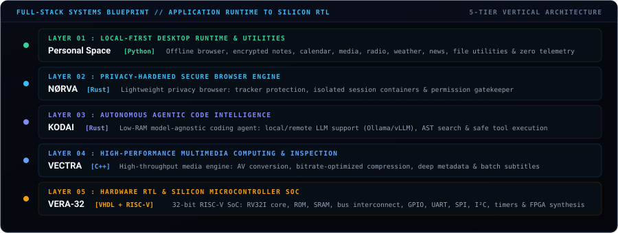

<!-- ===================================================================== -->
<!-- 1. HERO SYSTEMS MASTHEAD                                              -->
<!-- ===================================================================== -->

  

<!-- ===================================================================== -->
<!-- 2. FULL-STACK SYSTEMS ARCHITECTURAL BLUEPRINT                         -->
<!-- ===================================================================== -->

 

<!-- ===================================================================== -->
<!-- 3. FLAGSHIP SYSTEMS ROADMAP // WHAT WE'RE BUILDING                    -->
<!-- ===================================================================== -->

### `SYSTEMS_ROADMAP` // WHAT WE'RE BUILDING

A focused technical roadmap of 5 production-grade flagship systems spanning from local-first desktop environments down to custom 32-bit RISC-V silicon.

 

| # | Project | Stack | Layer | What We’re Building |
| :-: | :--- | :--- | :--- | :--- |
| **01** | **Privacy-First Personal Space** | `Python` | Local-First Workspace | Complete local-first desktop application with browser, notes, calendar, media, documents, radio, weather, news, file utilities, privacy features, etc. |
| **02** | **NØRVA** | `Rust` | Privacy Browser Engine | Lightweight, privacy-focused web browser with tracker protection, isolated sessions, permission controls, privacy dashboard, downloads, history, etc. |
| **03** | **KODAI** | `Rust` | Autonomous AI Agent | Low-RAM, model-agnostic coding AI agent that can connect to local coding LLMs or external LLM APIs and operate on real codebases through controlled tools. |
| **04** | **VECTRA** | `C++` | High-Throughput Media | High-performance media processing/analysis suite for video/audio conversion, compression, metadata, subtitles, batch processing, media inspection, etc. |
| **05** | **VERA-32** | `VHDL` • `RISC-V` | Microcontroller SoC | Our own 32-bit RISC-V microcontroller SoC: CPU core, ROM, SRAM, bus, GPIO, UART, SPI, I²C, timers, interrupts, firmware support, simulation and FPGA deployment. |

 

<!-- ===================================================================== -->
<!-- 4. IN-DEPTH TECHNICAL SPECIFICATIONS & ARCHITECTURE                   -->
<!-- ===================================================================== -->

### `TECHNICAL_DOSSIER` // FLAGSHIP SYSTEMS SPECIFICATIONS

 

> ### `01` / Privacy-First Personal Space
> **Architecture Layer**: Local-First Desktop Workspace &amp; Offline Productivity  
> **Primary Language**: `Python 3.11+` • **Storage Engine**: `Encrypted SQLite` • **Telemetry**: `Zero External Telemetry`
>
> A complete, local-first offline desktop application engineered as a unified private computing hub with zero cloud dependencies.
>
> - **Offline Productivity Suite**: Embedded private browser, client-side encrypted markdown knowledge base, offline calendar, agenda scheduling, and document management.
> - **Media &amp; Streaming Hub**: Integrated offline audio/video playback engine, low-overhead streaming internet radio tuner with zero tracking headers, offline-cached weather forecasts, and RSS feed readers.
> - **Privacy &amp; File Utilities**: Local cryptographic checksum generation (SHA-256, BLAKE3), multi-pass secure file shredding, EXIF and document metadata scrubbing, and batch renaming utilities.
> - **Local Data Persistence**: 100% offline data integrity backed by local encrypted SQLite storage without third-party cloud synchronization or background telemetry.

 

> ### `02` / NØRVA
> **Architecture Layer**: Privacy-Hardened Secure Web Browser  
> **Primary Language**: `Rust` • **Focus**: `Zero-Telemetry Browsing &amp; Ephemeral State Isolation`
>
> A lightweight, memory-safe, privacy-focused web browser engineered from the ground up to prevent user tracking, telemetry collection, and fingerprinting vectors.
>
> - **Network-Level Tracker Neutralization**: Native request interception blocking analytics trackers, telemetry beacons, and canvas/audio fingerprinting vectors before execution.
> - **Isolated Session Compartmentalization**: Ephemeral browsing containers ensuring isolated cookie jars, cache partitions, and local storage instances per tab or profile to defeat cross-site state tracking.
> - **Fine-Grained Permission Controls**: Strict hardware and web API permission controllers (camera, microphone, geolocation, clipboard access) with automatic revocation upon tab backgrounding.
> - **Real-Time Privacy Dashboard**: Live inspection console displaying blocked scripts, network request payloads, TLS certificate details, and origin security ratings.

 

> ### `03` / KODAI
> **Architecture Layer**: Autonomous Agentic Code Intelligence  
> **Primary Language**: `Rust` • **Runtimes**: `Local LLMs (Ollama / llama.cpp / vLLM) &amp; Frontier APIs`
>
> A low-RAM, model-agnostic coding AI agent engineered in Rust to operate autonomously on real-world production codebases through controlled, sandboxed tooling.
>
> - **Model-Agnostic LLM Connectivity**: Native bindings for local self-hosted inference runtimes (Ollama, llama.cpp, vLLM) or external frontier provider APIs (Anthropic Claude, OpenAI, DeepSeek) through unified streaming clients.
> - **Sandboxed Tool Execution Layer**: Controlled execution environment for AST-aware code navigation, semantic codebase search, unified diff generation, lint verification, and automated test suite execution.
> - **Minimal Memory Footprint**: Leverages Rust's zero-cost abstractions, deterministic memory management, and async concurrency to operate smoothly within constrained RAM environments (<4GB).
> - **Context &amp; Token Optimization**: Tree-sitter AST pruning and intelligent prompt compression to maximize token utility and reduce inference latency.

 

> ### `04` / VECTRA
> **Architecture Layer**: High-Performance Media Processing &amp; Structural Inspection  
> **Primary Language**: `C++` (Modern C++20) • **Acceleration**: `SIMD (AVX2/NEON) &amp; Multi-Threading`
>
> A high-throughput multimedia processing, conversion, and structural inspection suite engineered in modern C++ for massive parallel batch workflows.
>
> - **SIMD-Accelerated Transcoding**: High-speed video and audio format conversion leveraging multi-threaded pipeline execution and SIMD vector instructions (AVX2/NEON).
> - **Bitrate-Optimized Compression**: Lossless and perceptually tuned compression algorithms (SSIM/VMAF) delivering maximum quality retention at minimized file footprints.
> - **Deep Structural Stream Inspection**: Low-level parsing of container formats (MP4, MKV, WebM, TS); extracts container headers, stream codecs, color primaries, HDR metadata, GOP structures, and timestamp drifts.
> - **Automated Subtitle Pipeline**: Extraction of embedded subtitle tracks, OCR synchronization of bitmap subtitles, timestamp alignment, and batch conversion to WebVTT/SRT.

 

> ### `05` / VERA-32
> **Architecture Layer**: Hardware RTL &amp; Silicon Microcontroller SoC  
> **Primary Language**: `VHDL` • `RISC-V Assembly` • `Bare-Metal C` • **Target**: `FPGA Deployment &amp; Synthesis`
>
> A custom-engineered 32-bit RISC-V microcontroller System-on-Chip (SoC) designed from the RTL level up for embedded control, real-time sensing, and FPGA synthesis.
>
> - **Custom RV32I Processor Core**: Fully synthesizable single-issue instruction execution pipeline implementing the base RV32I integer instruction set with hazard detection and forwarding.
> - **Integrated Memory Architecture**: On-chip Boot ROM (firmware &amp; bootloader store) and low-latency internal SRAM data memory linked via a custom synchronous interconnect bus.
> - **Hardware Peripheral Matrix**:
>   - **UART**: Full-duplex asynchronous serial transceiver with configurable baud-rate generation and hardware FIFO buffers.
>   - **SPI &amp; I²C Masters**: Synchronous serial controllers for interfacing external sensors, EEPROMs, and display drivers.
>   - **GPIO &amp; Timers**: Configurable general-purpose I/O with edge interrupts and 32-bit periodic countdown timers.
>   - **Vectored Interrupt Controller (VIC)**: Low-latency deterministic hardware interrupt dispatcher.
> - **Simulation &amp; Toolchain**: Bare-metal C/Assembly firmware toolchain support, cycle-accurate VHDL testbench simulations (GHDL/ModelSim), and FPGA deployment.

 

  

<!-- ===================================================================== -->
<!-- 5. ENGINEERING ARSENAL // LANGUAGES, HARDWARE & RUNTIMES             -->
<!-- ===================================================================== -->

### `ENGINEERING_ARSENAL` // SYSTEMS, HARDWARE &amp; RUNTIMES

 

  
  &nbsp;&nbsp;
  
  &nbsp;&nbsp;
  
  &nbsp;&nbsp;
  
  &nbsp;&nbsp;
  

 

  <code>Python</code> &nbsp;•&nbsp;
  <code>Rust</code> &nbsp;•&nbsp;
  <code>C++</code> &nbsp;•&nbsp;
  <code>VHDL</code> &nbsp;•&nbsp;
  <code>RISC-V Assembly</code> &nbsp;•&nbsp;
  <code>C</code> &nbsp;•&nbsp;
  <code>Bash / Shell</code> &nbsp;•&nbsp;
  <code>RV32I ISA</code> &nbsp;•&nbsp;
  <code>FPGA Synthesis</code> &nbsp;•&nbsp;
  <code>SIMD (AVX2/NEON)</code> &nbsp;•&nbsp;
  <code>SQLite</code> &nbsp;•&nbsp;
  <code>Linux Internals</code>

<!-- ===================================================================== -->
<!-- 6. VERIFIED RESEARCH CREDENTIALS & ACADEMIC PEDIGREE                 -->
<!-- ===================================================================== -->

### `ACCREDITATIONS` // RESEARCH &amp; ACADEMIC EXCELLENCE

 

 

  🎓 <b>Master of Science in Information Technology (M.Sc. IT)</b> — Mumbai University (<b>CGPA: 8.7</b>) 
  <i>Passed Inter-Collegiate Test for Final Year Project Grant</i>  
  🎓 <b>Bachelor of Science in Information Technology (B.Sc. IT)</b> — Mumbai University (<b>CGPA: 8.3</b>) 
  <i>Event Lead for Inter-Collegiate Tech Summit</i>

<!-- ===================================================================== -->
<!-- 7. CONTRIBUTION ACTIVITY STREAM                                       -->
<!-- ===================================================================== -->

### `ACTIVITY_STREAM` // CONTINUOUS CODE COMMITS

<picture>
  <source media="(prefers-color-scheme: dark)" srcset="https://raw.githubusercontent.com/utkarsh-manoj-pandey/utkarsh-manoj-pandey/output/github-contribution-grid-snake-dark.svg" />
  <source media="(prefers-color-scheme: light)" srcset="https://raw.githubusercontent.com/utkarsh-manoj-pandey/utkarsh-manoj-pandey/output/github-contribution-grid-snake.svg" />
  
</picture>

<!-- ===================================================================== -->
<!-- 8. SECURE UPLINK // DIRECT COMMUNICATION CHANNELS                     -->
<!-- ===================================================================== -->

### `SECURE_UPLINK` // DIRECT TRANSMISSION

<i>Open to discussions on silicon microarchitecture, systems engineering in Rust/C++, and autonomous agent architectures.</i>

 

  
  &nbsp;&nbsp;
  
  &nbsp;&nbsp;
  
  &nbsp;&nbsp;
  

 

  <code>[ 2026 // UTKARSH MANOJ PANDEY // SYSTEMS &amp; SILICON LAB // ACTIVE ]</code>

