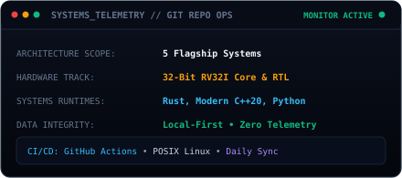

<!-- ===================================================================== -->
<!-- 1. UNIFIED MASTER COMMAND DECK (ALL SYSTEMS, SOLAR SYSTEM & TERMINAL) -->
<!-- ===================================================================== -->

  

<!-- ===================================================================== -->
<!-- 2. GITHUB TELEMETRY // LIVE DAILY STREAK & COMMIT STREAM              -->
<!-- ===================================================================== -->

<table align="center" border="0" cellpadding="0" cellspacing="0" style="border-collapse: collapse; border: none;">
  <tr align="center" valign="middle" style="border: none;">
    <td align="center" style="border: none; padding: 4px;">
      
    </td>
    <td align="center" style="border: none; padding: 4px;">
      
    </td>
  </tr>
</table>

<picture>
  <source media="(prefers-color-scheme: dark)" srcset="https://raw.githubusercontent.com/utkarsh-manoj-pandey/utkarsh-manoj-pandey/output/github-contribution-grid-snake-dark.svg" />
  <source media="(prefers-color-scheme: light)" srcset="https://raw.githubusercontent.com/utkarsh-manoj-pandey/utkarsh-manoj-pandey/output/github-contribution-grid-snake.svg" />
  
</picture>

  

<!-- ===================================================================== -->
<!-- 3. SECURE UPLINK // DIRECT COMMUNICATION CHANNELS                     -->
<!-- ===================================================================== -->

  
  &nbsp;&nbsp;
  
  &nbsp;&nbsp;
  
  &nbsp;&nbsp;
  

  <code>[ 2026 // UTKARSH MANOJ PANDEY // SYSTEMS &amp; SILICON LAB // ALL SYSTEMS OPERATIONAL ]</code>

