<div align="center">

<!-- ===================================================================== -->
<!-- 1. DYNAMIC ANIMATED HERO HEADER                                      -->
<!-- ===================================================================== -->


<br/>

<!-- ===================================================================== -->
<!-- 2. ANIMATED MULTI-LINE TYPING TERMINAL SVG                            -->
<!-- ===================================================================== -->

<a href="https://github.com/utkarsh-manoj-pandey">
  
</a>

<br/>

<!-- ===================================================================== -->
<!-- 3. ANIMATED CYBERPUNK INITIALIZATION / LOADING BAR                    -->
<!-- ===================================================================== -->

<p align="center">
  
</p>

<!-- Quick Status Pills -->
<p align="center">
  <a href="https://linkedin.com/in/itsutkarshpandey/">
    
  </a>
  <a href="#flagship-projects">
    
  </a>
  <a href="https://github.com/utkarsh-manoj-pandey">
    
  </a>
  <a href="https://github.com/utkarsh-manoj-pandey">
    
  </a>
</p>

</div>

<p align="center">
  
</p>

<!-- ===================================================================== -->
<!-- 4. SYSTEM TELEMETRY HUD & AUDIO EQUALIZER                             -->
<!-- ===================================================================== -->

<div align="center">
  
  <br/><br/>
  
</div>

<br/>

<p align="center">
  
</p>

<!-- ===================================================================== -->
<!-- 5. ABOUT ME // TERMINAL SIMULATION                                    -->
<!-- ===================================================================== -->

### 🛰️ `SYSTEM://WHOAMI.zsh`

```bash
utkarsh@neuro-core:~$ neofetch --profile utkarsh-manoj-pandey
```

```yaml
  ██████╗  ███████╗██╗   ██╗     NAME      : Utkarsh Manoj Pandey
  ██╔══██╗ ██╔════╝██║   ██║     IDENTITY  : Data Scientist & AI/ML Engineer
  ██████╔╝ █████╗  ██║   ██║     LOCATION  : India 🇮🇳 (Global Remote Ready)
  ██╔═══╝  ██╔══╝  ██║   ██║     ALUM      : Meta Scifor Technologies
  ██║      ███████╗╚██████╔╝     PASSION   : Translating raw data into algorithmic intelligence
  ╚═╝      ╚══════╝ ╚═════╝      MOTTO     : "Trying To Do Better !!"

  [+] PRIMARY STACK    : Python 3.x • PyTorch • Scikit-Learn • Pandas • Flask
  [+] SPECIALIZATION   : Natural Language Processing (LSTM), Quantitative Finance, Predictive Modeling
  [+] INFRASTRUCTURE   : Docker • Git/GitHub CI/CD • Linux • RESTful APIs
  [+] RUNTIME STATUS   : ☕ 100% Caffeinated • 🎧 Lo-Fi Neural Flow State Active
```

<br/>

<p align="center">
  
</p>

<!-- ===================================================================== -->
<!-- 6. TECH STACK ARSENAL (ANIMATED & CATEGORIZED)                        -->
<!-- ===================================================================== -->

<div align="center">

## ⚡ TECH ARSENAL & WEAPONS OF CHOICE

<p align="center"><i>Constantly evolving my neural weights across data intelligence, modern backend architectures, and machine learning.</i></p>

<br/>

<!-- Interactive Skills Icons -->
<a href="https://skillicons.dev">
  
</a>

<br/><br/>

</div>

<table>
  <thead>
    <tr>
      <th width="33%" align="left">🧠 Machine Learning & Data</th>
      <th width="33%" align="left">🌐 Backend, APIs & Data Eng</th>
      <th width="34%" align="left">🛠️ Tools, Cloud & Environments</th>
    </tr>
  </thead>
  <tbody>
    <tr>
      <td valign="top">
        • <b>PyTorch & TensorFlow</b><br/>
        • <b>Scikit-Learn & SciPy</b><br/>
        • <b>NLP & LSTM Recurrent Nets</b><br/>
        • <b>Pandas & NumPy</b><br/>
        • <b>Matplotlib & Seaborn</b><br/>
        • <b>OpenCV Computer Vision</b><br/>
        • <b>Power BI Analytics</b>
      </td>
      <td valign="top">
        • <b>Python (3+ Years Advanced)</b><br/>
        • <b>Flask & Django</b><br/>
        • <b>FastAPI REST Architectures</b><br/>
        • <b>PostgreSQL & MySQL</b><br/>
        • <b>MongoDB & SQLite</b><br/>
        • <b>Web Scraping (BS4 / Selenium)</b><br/>
        • <b>JSON / Microservice APIs</b>
      </td>
      <td valign="top">
        • <b>Docker & Containerization</b><br/>
        • <b>Git & GitHub Actions</b><br/>
        • <b>Linux / Unix Shell Scripting</b><br/>
        • <b>Postman API Testing</b><br/>
        • <b>Jupyter & Google Colab</b><br/>
        • <b>VS Code & Neovim</b><br/>
        • <b>Yahoo Finance / REST Endpoints</b>
      </td>
    </tr>
  </tbody>
</table>

<br/>

<p align="center">
  
</p>

<!-- ===================================================================== -->
<!-- 7. FLAGSHIP PROJECTS SHOWCASE                                         -->
<!-- ===================================================================== -->

<div align="center">

<a id="flagship-projects"></a>
## 🚀 FLAGSHIP PROJECTS & INNOVATIONS

<p align="center"><i>A curated selection of real-world machine learning systems, financial quantitative analyzers, and scalable tools.</i></p>

</div>

<br/>

<table>
  <tr>
    <td width="50%" valign="top">
      <h3 align="left">🔬 01. SciFor Data Science Suite</h3>
      <p>Cutting-edge data science research and analytical modeling engineered during my tenure at <b>Meta Scifor Technologies</b>. Bridges the gap between experimental data exploration and production-ready machine learning solutions.</p>
      <p>
        
        
        
        
      </p>
      <p>
        <a href="https://github.com/utkarsh-manoj-pandey/SciFor">
          
        </a>
      </p>
    </td>
    <td width="50%" valign="top">
      <h3 align="left">📊 02. Stock Market Quantitative Analyzer</h3>
      <p>High-dimensional quantitative analysis modeling historical price movements, returns, volatility, and risk metrics for industry giants: <b>Apple, Google, Microsoft, and Amazon</b> sourced directly via Yahoo Finance APIs.</p>
      <p>
        
        
        
        
      </p>
      <p>
        <a href="https://github.com/utkarsh-manoj-pandey/Stock-Market-Analysis-Using-Python--">
          
        </a>
      </p>
    </td>
  </tr>
  <tr>
    <td width="50%" valign="top">
      <h3 align="left">🛒 03. Amazon Product Insight Miner</h3>
      <p>High-throughput automated web scraping framework for Amazon search results. Extracts real-time product metrics, pricing trends, customer ratings, review volume, and competitive market data.</p>
      <p>
        
        
        
        
      </p>
      <p>
        <a href="https://github.com/utkarsh-manoj-pandey/-Amazon-Product-Insight-Miner-">
          
        </a>
      </p>
    </td>
    <td width="50%" valign="top">
      <h3 align="left">🧠 04. Twitter Sentiment Engine (NLP & LSTM)</h3>
      <p>Deep learning recurrent neural network classifier leveraging <b>Natural Language Processing</b> and <b>Long Short-Term Memory (LSTM)</b> networks to predict granular emotional sentiments within live microblog streams.</p>
      <p>
        
        
        
        
      </p>
      <p>
        <a href="https://github.com/utkarsh-manoj-pandey/Twitter-Sentiment-Analysis-with-NLP-and-LSTM">
          
        </a>
      </p>
    </td>
  </tr>
  <tr>
    <td width="50%" valign="top">
      <h3 align="left">📈 05. Awesome Consumer Complaints Analysis</h3>
      <p>Enterprise exploratory data analytics pipeline uncovering hidden patterns and service bottlenecks from vast consumer complaint datasets to optimize enterprise customer retention and SLA adherence.</p>
      <p>
        
        
        
      </p>
      <p>
        <a href="https://github.com/utkarsh-manoj-pandey/-Consumer-Insight-Explorer-">
          
        </a>
      </p>
    </td>
    <td width="50%" valign="top">
      <h3 align="left">🎬 06. Intelligent Movie Recommendation Engine</h3>
      <p>Hybrid recommendation architecture blending content-based filtering and popularity heuristics. Deployed with a responsive <b>Flask</b> backend and powered by <b>scikit-learn</b> cosine distance algorithms.</p>
      <p>
        
        
        
      </p>
      <p>
        <a href="https://github.com/utkarsh-manoj-pandey/-Movie-Recommendation-System-">
          
        </a>
      </p>
    </td>
  </tr>
</table>

<br/>

<p align="center">
  
</p>

<!-- ===================================================================== -->
<!-- 8. GITHUB TELEMETRY & STATS MATRIX                                   -->
<!-- ===================================================================== -->

<div align="center">

## 📊 GITHUB REAL-TIME TELEMETRY

<p align="center"><i>Live real-time analytics syncing directly with the GitHub API.</i></p>

<br/>

<!-- Stats Grid -->
<table border="0">
  <tr>
    <td align="center" width="50%">
      
    </td>
    <td align="center" width="50%">
      
    </td>
  </tr>
  <tr>
    <td align="center" colspan="2">
      
    </td>
  </tr>
</table>

<br/>

<!-- Interactive Contribution Activity Graph -->


</div>

<br/>

<p align="center">
  
</p>

<!-- ===================================================================== -->
<!-- 9. CONTRIBUTION SNAKE EATING CODE GRAPH                               -->
<!-- ===================================================================== -->

<div align="center">

### 🐍 CODE CONSUMPTION ENGINE

<p align="center"><i>A playful animated snake consuming commit contributions on the GitHub grid!</i></p>

<picture>
  <source media="(prefers-color-scheme: dark)" srcset="https://raw.githubusercontent.com/utkarsh-manoj-pandey/utkarsh-manoj-pandey/output/github-contribution-grid-snake-dark.svg" />
  <source media="(prefers-color-scheme: light)" srcset="https://raw.githubusercontent.com/utkarsh-manoj-pandey/utkarsh-manoj-pandey/output/github-contribution-grid-snake.svg" />
  
</picture>

</div>

<br/>

<p align="center">
  
</p>

<!-- ===================================================================== -->
<!-- 10. ACHIEVEMENTS & TROPHIES                                           -->
<!-- ===================================================================== -->

<div align="center">

### 🏆 GITHUB HALL OF ACHIEVEMENTS

<a href="https://github.com/utkarsh-manoj-pandey">
  
</a>

</div>

<br/>

<p align="center">
  
</p>

<!-- ===================================================================== -->
<!-- 11. CONNECT & TRANSMIT                                                -->
<!-- ===================================================================== -->

<div align="center">

## 🌐 TRANSMIT & CONNECT

<p align="center"><i>Got an ambitious project, an AI/ML role, or want to discuss quantitative finance & deep learning? Let's connect!</i></p>

<br/>

<p align="center">
  <a href="https://linkedin.com/in/itsutkarshpandey/" target="_blank">
    
  </a>
  &nbsp;&nbsp;
  <a href="https://twitter.com/_Pandey_Utkarsh" target="_blank">
    
  </a>
  &nbsp;&nbsp;
  <a href="mailto:utkarsh.manoj.pandey@gmail.com" target="_blank">
    
  </a>
  &nbsp;&nbsp;
  <a href="https://github.com/utkarsh-manoj-pandey" target="_blank">
    
  </a>
</p>

<br/>

<!-- Quote / Sign-off -->
<p align="center">
  <i>"Any sufficiently advanced technology is indistinguishable from magic. Keep building."</i>
</p>

<br/>

<!-- Animated Footer Wave -->


</div>
