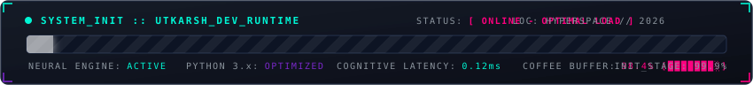

<div align="center">

<!-- ===================================================================== -->
<!-- 1. BESPOKE EXECUTIVE MASTHEAD / HERO                                  -->
<!-- ===================================================================== -->



<br/>

<!-- ===================================================================== -->
<!-- 2. HIGH-PRECISION RUNTIME & DIAGNOSTICS                               -->
<!-- ===================================================================== -->



<br/><br/>

<!-- Minimalist Professional Status Indicators -->
<p align="center">
  
  &nbsp;
  
  &nbsp;
  
  &nbsp;
  
  &nbsp;
  
</p>

</div>

<p align="center">
  
</p>

<!-- ===================================================================== -->
<!-- 3. LIVE CONVERGENCE HUD & SYSTEM DIAGNOSTICS                         -->
<!-- ===================================================================== -->

<div align="center">
  
</div>

<br/>

<p align="center">
  
</p>

<!-- ===================================================================== -->
<!-- 4. EXECUTIVE PROFILE & ARCHITECTURE SPECS                             -->
<!-- ===================================================================== -->

### `SYSTEM_OVERVIEW` // CORE ARCHITECTURE

```yaml
architect:
  name: "Utkarsh Manoj Pandey"
  designation: "Data Scientist & Artificial Intelligence Engineer"
  alumnus: "Meta Scifor Technologies"
  location: "India (Global Remote Capable)"
  runtime_status: "Active // Developing Next-Gen Intelligent Pipelines"

engineering_ethos:
  philosophy: "Transforming raw stochastic data into high-precision algorithmic value."
  discipline: "Clean, modular code with mathematical rigor and production resilience."

technical_pillars:
  deep_learning: ["Recurrent Neural Networks (LSTM)", "Transformers", "NLP Classification"]
  quantitative_finance: ["Multi-Asset Risk Modeling", "Time-Series Econometrics", "Volatility Analytics"]
  data_engineering: ["High-Throughput Crawlers", "ETL Optimization", "Feature Extraction Pipelines"]
  backend_systems: ["FastAPI Microservices", "Flask REST APIs", "Relational & NoSQL Stores"]
```

<br/>

<p align="center">
  
</p>

<!-- ===================================================================== -->
<!-- 5. TECHNICAL ARSENAL (CURATED BENTO GRID)                             -->
<!-- ===================================================================== -->

<div align="center">

### `TECH_ARSENAL` // WEAPONS & INFRASTRUCTURE

<p align="center"><i>Curated tools and frameworks deployed across machine learning, analytical modeling, and distributed backend systems.</i></p>

<br/>

<!-- Sleek Dark Icons Strip -->
<a href="https://skillicons.dev">
  
</a>

<br/><br/>

</div>

<table>
  <thead>
    <tr>
      <th width="33%" align="left"><b>01 / MACHINE LEARNING &amp; DATA</b></th>
      <th width="33%" align="left"><b>02 / BACKEND &amp; DATA ENGINEERING</b></th>
      <th width="34%" align="left"><b>03 / INFRASTRUCTURE &amp; ENVIRONMENT</b></th>
    </tr>
  </thead>
  <tbody>
    <tr>
      <td valign="top">
        • <b>PyTorch &amp; TensorFlow</b> — Deep Neural Nets<br/>
        • <b>Scikit-Learn</b> — Predictive Classifiers<br/>
        • <b>NLP &amp; LSTM</b> — Sequential Text Modeling<br/>
        • <b>Pandas &amp; NumPy</b> — Vectorized Operations<br/>
        • <b>SciPy &amp; Matplotlib</b> — Scientific Analysis<br/>
        • <b>Power BI &amp; Seaborn</b> — Visual Intelligence
      </td>
      <td valign="top">
        • <b>Python (CPython)</b> — High-Performance Scripts<br/>
        • <b>FastAPI &amp; Flask</b> — Asynchronous Microservices<br/>
        • <b>Django</b> — Robust Application Backends<br/>
        • <b>PostgreSQL &amp; MySQL</b> — Structured Relational<br/>
        • <b>MongoDB &amp; SQLite</b> — Document &amp; Edge Stores<br/>
        • <b>Scrapy &amp; Selenium</b> — Distributed Web Scrapers
      </td>
      <td valign="top">
        • <b>Docker</b> — Containerization &amp; Images<br/>
        • <b>Git &amp; GitHub Actions</b> — CI/CD Automation<br/>
        • <b>Linux (Ubuntu/Debian)</b> — System Architecture<br/>
        • <b>JupyterLab &amp; Colab</b> — Exploratory Research<br/>
        • <b>Postman</b> — API Protocol Verification<br/>
        • <b>VS Code &amp; Unix Shell</b> — Ergonomic Tooling
      </td>
    </tr>
  </tbody>
</table>

<br/>

<p align="center">
  
</p>

<!-- ===================================================================== -->
<!-- 6. FLAGSHIP ENGINEERING PROJECTS (CASE STUDIES)                       -->
<!-- ===================================================================== -->

### `CASE_STUDIES` // FLAGSHIP SYSTEMS & REPOSITORIES

<table>
  <tr>
    <td width="50%" valign="top">
      <h4><code>01</code> // SCIFOR DATA SCIENCE PLATFORM</h4>
      <p>Enterprise data science and exploratory machine learning infrastructure developed during tenure at <b>Meta Scifor Technologies</b>. Bridges the gap between experimental data exploration and production-grade analytical pipelines.</p>
      <p><code>Python</code> • <code>Scikit-Learn</code> • <code>Pandas</code> • <code>EDA</code></p>
      <p>
        <a href="https://github.com/utkarsh-manoj-pandey/SciFor">
          
        </a>
      </p>
    </td>
    <td width="50%" valign="top">
      <h4><code>02</code> // MULTI-ASSET QUANTITATIVE FINANCIAL ANALYZER</h4>
      <p>Algorithmic time-series analysis framework evaluating historical risk, beta, volatility, and return distributions for <b>Apple, Google, Microsoft, and Amazon</b> using streaming Yahoo Finance APIs.</p>
      <p><code>Quantitative Finance</code> • <code>NumPy</code> • <code>Time-Series</code> • <code>APIs</code></p>
      <p>
        <a href="https://github.com/utkarsh-manoj-pandey/Stock-Market-Analysis-Using-Python--">
          
        </a>
      </p>
    </td>
  </tr>
  <tr>
    <td width="50%" valign="top">
      <h4><code>03</code> // DISTRIBUTED AMAZON PRODUCT MINER</h4>
      <p>High-throughput automated web data extraction engine engineered to crawl, parse, and normalize Amazon search catalog data (pricing elasticity, rating distributions, and review velocity).</p>
      <p><code>Web Scraping</code> • <code>ETL Pipeline</code> • <code>Data Mining</code> • <code>Automation</code></p>
      <p>
        <a href="https://github.com/utkarsh-manoj-pandey/-Amazon-Product-Insight-Miner-">
          
        </a>
      </p>
    </td>
    <td width="50%" valign="top">
      <h4><code>04</code> // REAL-TIME TWITTER NLP &amp; LSTM ENGINE</h4>
      <p>Deep learning recurrent neural network classifier utilizing <b>Natural Language Processing</b> and <b>Long Short-Term Memory (LSTM)</b> architectures to predict sentiment vectors across dynamic microblog streams.</p>
      <p><code>Deep Learning</code> • <code>LSTM</code> • <code>NLP</code> • <code>TensorFlow</code></p>
      <p>
        <a href="https://github.com/utkarsh-manoj-pandey/Twitter-Sentiment-Analysis-with-NLP-and-LSTM">
          
        </a>
      </p>
    </td>
  </tr>
  <tr>
    <td width="50%" valign="top">
      <h4><code>05</code> // ENTERPRISE CONSUMER COMPLAINT INTELLIGENCE</h4>
      <p>Exploratory data analytics and statistical modeling suite analyzing large-scale consumer complaint corpora to isolate operational bottlenecks and predict resolution turnaround.</p>
      <p><code>Data Intelligence</code> • <code>Seaborn</code> • <code>Statistical Modeling</code> • <code>Pandas</code></p>
      <p>
        <a href="https://github.com/utkarsh-manoj-pandey/-Consumer-Insight-Explorer-">
          
        </a>
      </p>
    </td>
    <td width="50%" valign="top">
      <h4><code>06</code> // HYBRID RECOMMENDATION ENGINE</h4>
      <p>Dual-model recommendation architecture harmonizing cosine-similarity content filtering with popularity heuristics, deployed through a low-latency <b>Flask</b> REST microservice.</p>
      <p><code>Recommendation Systems</code> • <code>Scikit-Learn</code> • <code>Flask</code> • <code>Cosine Distance</code></p>
      <p>
        <a href="https://github.com/utkarsh-manoj-pandey/-Movie-Recommendation-System-">
          
        </a>
      </p>
    </td>
  </tr>
</table>

<br/>

<p align="center">
  
</p>

<!-- ===================================================================== -->
<!-- 7. REAL-TIME GITHUB TELEMETRY MATRIX                                 -->
<!-- ===================================================================== -->

<div align="center">

### `TELEMETRY` // REAL-TIME GITHUB ANALYTICS

<p align="center"><i>Live telemetry synchronized continuously via the GitHub API.</i></p>

<br/>

<table border="0">
  <tr>
    <td align="center" width="50%">
      
    </td>
    <td align="center" width="50%">
      
    </td>
  </tr>
  <tr>
    <td align="center" colspan="2">
      
    </td>
  </tr>
</table>

<br/>

<!-- Real-time Contribution Graph (Monochrome / Indigo Accent) -->


</div>

<br/>

<p align="center">
  
</p>

<!-- ===================================================================== -->
<!-- 8. CONTRIBUTION GRID CONSUMPTION SNAKE                               -->
<!-- ===================================================================== -->

<div align="center">

### `ACTIVITY_STREAM` // CODE CONSUMPTION ENGINE

<picture>
  <source media="(prefers-color-scheme: dark)" srcset="https://raw.githubusercontent.com/utkarsh-manoj-pandey/utkarsh-manoj-pandey/output/github-contribution-grid-snake-dark.svg" />
  <source media="(prefers-color-scheme: light)" srcset="https://raw.githubusercontent.com/utkarsh-manoj-pandey/utkarsh-manoj-pandey/output/github-contribution-grid-snake.svg" />
  
</picture>

</div>

<br/>

<p align="center">
  
</p>

<!-- ===================================================================== -->
<!-- 9. SECURE UPLINK // CONNECT & ENGAGE                                 -->
<!-- ===================================================================== -->

<div align="center">

### `SECURE_UPLINK` // DIRECT TRANSMISSION

<p align="center"><i>Available for high-impact AI/ML engineering roles, quantitative analytics initiatives, and advanced open-source collaboration.</i></p>

<br/>

<p align="center">
  <a href="https://linkedin.com/in/itsutkarshpandey/" target="_blank">
    
  </a>
  &nbsp;&nbsp;
  <a href="https://twitter.com/_Pandey_Utkarsh" target="_blank">
    
  </a>
  &nbsp;&nbsp;
  <a href="mailto:utkarsh.manoj.pandey@gmail.com" target="_blank">
    
  </a>
  &nbsp;&nbsp;
  <a href="https://github.com/utkarsh-manoj-pandey" target="_blank">
    
  </a>
</p>

<br/>

<p align="center">
  <font color="#64748b" size="2">
    <code>[ 2026 // UTKARSH MANOJ PANDEY // ALL SYSTEMS OPERATIONAL ]</code>
  </font>
</p>

</div>
