<!-- ===================================================================== -->
<!-- 1. MASTER COMMAND DECK & HARDWARE TELEMETRY CONSOLE                   -->
<!-- ===================================================================== -->

  

<!-- ===================================================================== -->
<!-- 2. HARDWARE & OPERATING SYSTEM ARCHITECTURAL SCHEMATIC                -->
<!-- ===================================================================== -->

 

<!-- ===================================================================== -->
<!-- 3. IN-DEPTH TECHNICAL CAPABILITIES DOSSIER                           -->
<!-- ===================================================================== -->

### `TECHNICAL_DOSSIER` // ADVANCED SYSTEMS CAPABILITIES

 

> #### 🧠 01 / Edge AI & Autonomous Multimodal Voice Agents
> - **Fine-Tuning State-of-the-Art Open LLMs**: Specialized in parameter-efficient fine-tuning and quantization of modern open-source LLMs (**Llama 3.3** and **DeepSeek R1**) for edge-device deployment.
> - **SIFRA Personal Voice Assistant**: Built an edge-hosted intelligent voice assistant directly on a **Raspberry Pi 5 equipped with an M.2 NVMe PCIe Gen3 SSD** for low-latency weight loading and rapid inference.
> - **Dual-Factor Biometric Hardware Pipeline**: Integrated **facial biometric authentication (OpenCV)** and **voiceprint recognition**, ensuring multi-tiered biometric access before agent execution.
> - **Continuous ASR Automation**: Low-latency speech recognition streaming pipelines driving automated desktop actions, browser workflows, and hands-free computer control (**EDITH & SIFRA**).

 

> #### ⚡ 02 / Custom Operating Systems & Kernel Engineering
> - **Prometheus Operating System**: Architected a custom **Arch Linux-based Operating System** optimized to boot from high-speed external M.2 NVMe SSDs across **ARM64 (Raspberry Pi 5)** and **x86_64** hardware.
> - **Embedded Linux Runtime Optimization**: Advanced kernel parameter tuning, custom systemd daemon services, and shell automation scripts on **Manjaro Linux, Oracle Linux, Raspberry Pi OS, and Arch Linux**.
> - **RISC-V Microarchitecture**: Deep architectural comprehension of **Instruction Set Architecture (ISA)**, multi-stage instruction pipelining, hazard resolution, and processor microarchitecture fundamentals.

 

> #### 🤖 03 / Advanced Web Automation & Desktop Engineering
> - **Autonomous Web Execution**: Programmatic browser automation with **Playwright & Selenium** to orchestrate complex, headless multi-step workflows (autonomous YouTube navigation, automated Amazon search catalog mining).
> - **Native Graphical Interfaces**: Architecting multi-threaded desktop GUI applications using **PyQt** integrated with asynchronous Python event loops and local databases.
> - **Multimodal Storage Pipelines**: Structuring high-speed local data stores (**SQLite / NoSQL**) optimized for audio-visual datasets, biometric embeddings, and telemetry logs.

 

> #### 🔬 04 / Polyglot Systems & Multi-Paradigm Languages
> - **Low-Level & Bare-Metal**: `C` • `C++` • `Rust` • `Go` • `Pro*C`
> - **AI, Mathematical & Scientific Runtimes**: `Python 3.11+` • `Julia` • `R` • `Scala` • `Java`
> - **Shell & Automation Scripting**: `Bash / Shell Scripting` • `PowerShell`
> - **Databases & Enterprise Query Engines**: `SQLite` • `PostgreSQL` • `OracleDB` • `SQL Server` • `MongoDB (NoSQL)`

 

  

<!-- ===================================================================== -->
<!-- 4. RESEARCH CREDENTIALS & ACADEMIC PEDIGREE                           -->
<!-- ===================================================================== -->

### `CREDENTIALS` // RESEARCH & ACADEMIC ACCREDITATIONS

 

 

  🎓 <b>Master of Science in Information Technology (M.Sc. IT)</b> — Mumbai University (<b>CGPA: 8.7</b>) 
  <i>Passed Inter-Collegiate Test for Final Year Project Grant (Prometheus OS &amp; SIFRA Voice Assistant)</i>  
  🎓 <b>Bachelor of Science in Information Technology (B.Sc. IT)</b> — Mumbai University (<b>CGPA: 8.3</b>) 
  <i>Event Lead for Inter-Collegiate Tech Summit • Final Year Project: EDITH (x86_64 Voice Intelligence)</i>

 

  

<!-- ===================================================================== -->
<!-- 5. CONTRIBUTION ACTIVITY STREAM                                       -->
<!-- ===================================================================== -->

### `ACTIVITY_STREAM` // CONTINUOUS CODE CONSUMPTION

<picture>
  <source media="(prefers-color-scheme: dark)" srcset="https://raw.githubusercontent.com/utkarsh-manoj-pandey/utkarsh-manoj-pandey/output/github-contribution-grid-snake-dark.svg" />
  <source media="(prefers-color-scheme: light)" srcset="https://raw.githubusercontent.com/utkarsh-manoj-pandey/utkarsh-manoj-pandey/output/github-contribution-grid-snake.svg" />
  
</picture>

 

  

<!-- ===================================================================== -->
<!-- 6. SECURE UPLINK // DIRECT COMMUNICATION CHANNELS                     -->
<!-- ===================================================================== -->

### `SECURE_UPLINK` // DIRECT TRANSMISSION

<i>Available for cutting-edge AI systems development, embedded intelligence architectures, and advanced engineering initiatives.</i>

 

  
  &nbsp;&nbsp;
  
  &nbsp;&nbsp;
  
  &nbsp;&nbsp;
  

 

  <code>[ 2026 // UTKARSH MANOJ PANDEY // PROMETHEUS OS ACTIVE // ALL SYSTEMS OPERATIONAL ]</code>

