<!-- ===================================================================== -->
<!-- 1. LIVE SOLAR SYSTEM ANIMATED HERO MASTHEAD                           -->
<!-- ===================================================================== -->

  

<!-- Interactive Web Desktop Launch Button -->

  

 

<!-- ===================================================================== -->
<!-- 2. REAL LIVE GITHUB DAILY STREAK TRACKER                              -->
<!-- ===================================================================== -->

  

 

<!-- ===================================================================== -->
<!-- 3. FLAGSHIP SYSTEMS // PRODUCTION ROADMAP (CLEAN ARCHITECTURE TABLE)  -->
<!-- ===================================================================== -->

### `FLAGSHIP_SYSTEMS` // PRODUCTION ROADMAP

A focused engineering portfolio spanning from local-first desktop environments down to custom 32-bit RISC-V silicon.

 

| # | System | Stack | Architecture Layer | Status | What We’re Building |
| :-: | :--- | :--- | :--- | :-: | :--- |
| **01** | **Privacy-First Personal Space** | `Python 3.11+` | Local-First Workspace | `Planned` | A complete local-first desktop application with browser, notes, calendar, media, documents, radio, weather, news, file utilities, privacy features, etc. |
| **02** | **NØRVA** | `Rust` | Privacy Browser Engine | `Planned` | A lightweight, privacy-focused web browser with tracker protection, isolated sessions, permission controls, privacy dashboard, downloads, history, etc. |
| **03** | **KODAI** | `Rust` | Autonomous AI Agent | `Planned` | A low-RAM, model-agnostic coding AI agent that can connect to local coding LLMs or external LLM APIs and operate on real codebases through controlled tools. |
| **04** | **VECTRA** | `Modern C++20` | Media Processing Suite | `Planned` | A high-performance media processing/analysis suite for video/audio conversion, compression, metadata, subtitles, batch processing, media inspection, etc. |
| **05** | **VERA-32** | `VHDL` • `RISC-V` | Microcontroller SoC &amp; Silicon | `Planned` | Our own 32-bit RISC-V microcontroller SoC: CPU core, ROM, SRAM, bus, GPIO, UART, SPI, I²C, timers, interrupts, firmware support, simulation and FPGA deployment. |

 

  

<!-- ===================================================================== -->
<!-- 4. CORE ENGINEERING ARSENAL // LANGUAGES, SILICON & RUNTIMES          -->
<!-- ===================================================================== -->

### `ENGINEERING_ARSENAL` // SYSTEMS, HARDWARE &amp; RUNTIMES

 

  
  &nbsp;&nbsp;
  
  &nbsp;&nbsp;
  
  &nbsp;&nbsp;
  
  &nbsp;&nbsp;
  
  &nbsp;&nbsp;
  

 

  <code>Rust</code> &nbsp;•&nbsp;
  <code>Modern C++20</code> &nbsp;•&nbsp;
  <code>Python 3.11+</code> &nbsp;•&nbsp;
  <code>VHDL</code> &nbsp;•&nbsp;
  <code>RISC-V Assembly (RV32I)</code> &nbsp;•&nbsp;
  <code>Bare-Metal C</code> &nbsp;•&nbsp;
  <code>Bash / Shell</code> &nbsp;•&nbsp;
  <code>FPGA Synthesis</code> &nbsp;•&nbsp;
  <code>SIMD (AVX2/NEON)</code> &nbsp;•&nbsp;
  <code>Encrypted SQLite</code> &nbsp;•&nbsp;
  <code>Linux Internals</code>

<!-- ===================================================================== -->
<!-- 5. VERIFIED ACADEMIC PEDIGREE // RESEARCH EXCELLENCE                 -->
<!-- ===================================================================== -->

### `ACADEMIC_PEDIGREE` // RESEARCH EXCELLENCE

 

  🎓 <b>Master of Science in Information Technology (M.Sc. IT)</b> — Mumbai University (<b>CGPA: 8.7</b>) 
  <i>Passed Inter-Collegiate Test for Final Year Project Grant</i>  
  🎓 <b>Bachelor of Science in Information Technology (B.Sc. IT)</b> — Mumbai University (<b>CGPA: 8.3</b>) 
  <i>Event Lead for Inter-Collegiate Tech Summit</i>

<!-- ===================================================================== -->
<!-- 6. CONTRIBUTION ACTIVITY STREAM                                       -->
<!-- ===================================================================== -->

### `ACTIVITY_STREAM` // CONTINUOUS CODE COMMITS

<picture>
  <source media="(prefers-color-scheme: dark)" srcset="https://raw.githubusercontent.com/utkarsh-manoj-pandey/utkarsh-manoj-pandey/output/github-contribution-grid-snake-dark.svg" />
  <source media="(prefers-color-scheme: light)" srcset="https://raw.githubusercontent.com/utkarsh-manoj-pandey/utkarsh-manoj-pandey/output/github-contribution-grid-snake.svg" />
  
</picture>

<!-- ===================================================================== -->
<!-- 7. SECURE UPLINK // DIRECT COMMUNICATION CHANNELS                     -->
<!-- ===================================================================== -->

### `SECURE_UPLINK` // DIRECT TRANSMISSION

<i>Open to discussions on silicon microarchitecture, systems engineering in Rust/C++, and autonomous agent architectures.</i>

 

  
  &nbsp;&nbsp;
  
  &nbsp;&nbsp;
  
  &nbsp;&nbsp;
  

 

  <code>[ 2026 // UTKARSH MANOJ PANDEY // SYSTEMS &amp; SILICON LAB // ACTIVE ]</code>

