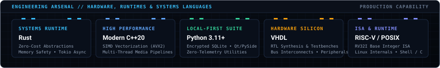

<div align="center">

<!-- ===================================================================== -->
<!-- 1. CINEMATIC HERO SYSTEMS MASTHEAD                                    -->
<!-- ===================================================================== -->



<br/><br/>

<!-- ===================================================================== -->
<!-- 2. ANIMATED LIVE TERMINAL DIAGNOSTICS CONSOLE (FIXED // ZERO OVERLAP) -->
<!-- ===================================================================== -->



<br/><br/>

<!-- ===================================================================== -->
<!-- 3. HARDWARE 5-STAGE CPU PIPELINE & SYSTEMS RADAR HUD                  -->
<!-- ===================================================================== -->



<br/><br/>

<!-- ===================================================================== -->
<!-- 4. GITHUB DAILY STREAK & COMMIT VELOCITY HUD                          -->
<!-- ===================================================================== -->



<br/>

<p align="center">
  
</p>

<br/>


</div>

<!-- ===================================================================== -->
<!-- 5. FLAGSHIP SYSTEMS // PRODUCTION ARCHITECTURAL ROADMAP               -->
<!-- ===================================================================== -->

### `FLAGSHIP_SYSTEMS` // PRODUCTION ROADMAP

A vertically integrated engineering portfolio spanning from local-first desktop environments down to custom 32-bit RISC-V silicon.

<br/>

<div align="center">
  
</div>

<br/>

```
┌────────────────────────────────────────────────────────────────────────┐
│ [01] PRIVACY-FIRST PERSONAL SPACE (Python 3.11+ • PySide • SQLite)     │
│ └── Local Desktop Suite: Browser • Encrypted Notes • Media • Shredder  │
└───────────────────────────────────┬────────────────────────────────────┘
                                    │ Interprocess Local Bridge
┌───────────────────────────────────┴────────────────────────────────────┐
│ [02] NØRVA (Rust • WebKit/Engine • Tokio)                              │
│ └── Privacy Web Browser: AST Tracker Interception • Ephemeral Storage  │
└───────────────────────────────────┬────────────────────────────────────┘
                                    │ IPC / Sandboxed Protocol
┌───────────────────────────────────┴────────────────────────────────────┐
│ [03] KODAI (Rust • Tree-Sitter • Local/Remote LLM APIs)                │
│ └── Autonomous Coding Agent: Model-Agnostic Core • Sandboxed AST Diffs │
└───────────────────────────────────┬────────────────────────────────────┘
                                    │ High-Throughput Batch Pipe
┌───────────────────────────────────┴────────────────────────────────────┐
│ [04] VECTRA (Modern C++20 • SIMD AVX2/NEON • FFmpeg APIs)              │
│ └── Media Computing Suite: Hardware Transcoding • VMAF • Subtitle OCR  │
└───────────────────────────────────┬────────────────────────────────────┘
                                    │ Bare-Metal Driver / Memory Map
┌───────────────────────────────────┴────────────────────────────────────┐
│ [05] VERA-32 (VHDL • RISC-V RV32I • Bare-Metal C • FPGA Deployment)    │
│ └── 32-Bit Microcontroller SoC: CPU Core • Bus Interconnect • Periphs  │
└────────────────────────────────────────────────────────────────────────┘
```

<br/>

> ### `01` / Privacy-First Personal Space
> **Stack**: `Python 3.11+` • `PySide/Qt` • `Encrypted SQLite`  
> **Architecture Layer**: Local-First Desktop Workspace &amp; Offline Productivity  
> **Telemetry Protocol**: `Zero External Calls // 100% Client-Side Local`
>
> A complete local-first desktop application engineered as a unified offline personal operating hub with zero cloud dependencies and complete user data sovereignty.
>
> - **Local-First Productivity**: Embedded private web browser, client-side encrypted markdown knowledge base, offline calendar, agenda scheduling, and document management.
> - **Media &amp; Streaming Hub**: Integrated offline media player, streaming internet radio tuner with zero telemetry headers, offline-cached weather forecasting, and RSS feed aggregators.
> - **Privacy &amp; File Utilities**: Local cryptographic hashing (SHA-256, BLAKE3), multi-pass secure file shredder, EXIF and document metadata scrubber, and batch file renaming.
> - **Data Persistence**: 100% offline data integrity backed by local encrypted SQLite storage without third-party cloud synchronization or background telemetry.

<br/>

> ### `02` / NØRVA
> **Stack**: `Rust` • `WebKit/Custom Engine` • `Tokio`  
> **Architecture Layer**: Privacy-Hardened Secure Web Browser  
> **Telemetry Protocol**: `Zero-Telemetry Browsing &amp; Ephemeral State Isolation`
>
> A lightweight, privacy-focused web browser engineered with zero telemetry and uncompromising user privacy at the core.
>
> - **Tracker Neutralization**: Native network request interception blocking telemetry beacons, analytics trackers, and canvas/audio fingerprinting vectors before execution.
> - **Isolated Session Compartmentalization**: Ephemeral browsing containers ensuring isolated cookie jars, cache partitions, and local storage instances per tab to defeat cross-site state tracking.
> - **Fine-Grained Permission Controls**: Strict runtime permission enforcement for hardware peripherals (camera, microphone), geolocation, and clipboard access with auto-revocation on tab sleep.
> - **Real-Time Privacy Dashboard**: Live inspection console displaying blocked scripts, network request payloads, TLS certificate details, and origin security metrics.

<br/>

> ### `03` / KODAI
> **Stack**: `Rust` • `Tree-Sitter` • `Local/Remote LLM APIs`  
> **Architecture Layer**: Autonomous Agentic Code Intelligence  
> **Target Footprint**: `Low-RAM Constraints (<4GB) // Zero Garbage Collection`
>
> A low-RAM, model-agnostic coding AI agent that can connect to local coding LLMs or external LLM APIs and operate on real codebases through controlled tools.
>
> - **Model-Agnostic LLM Connectivity**: Native bindings for local self-hosted inference runtimes (Ollama, llama.cpp, vLLM) or external frontier provider APIs (Anthropic Claude, OpenAI, DeepSeek) through unified streaming clients.
> - **Sandboxed Tool Execution Layer**: Controlled execution environment for AST-aware code navigation, semantic codebase search, unified diff generation, lint verification, and automated test execution.
> - **Minimal Memory Footprint**: Leverages Rust's zero-cost abstractions, deterministic memory management, and async concurrency to operate smoothly within constrained edge and developer machines.
> - **Context Window &amp; Token Optimization**: Tree-sitter AST pruning and intelligent prompt compression to maximize token utility and minimize inference latency.

<br/>

> ### `04` / VECTRA
> **Stack**: `Modern C++20` • `SIMD (AVX2/NEON)` • `FFmpeg / Multimedia APIs`  
> **Architecture Layer**: High-Performance Media Processing &amp; Structural Inspection  
> **Optimization**: `Multi-Threaded Batch Throughput &amp; Vectorized Execution`
>
> A high-performance media processing/analysis suite for video/audio conversion, compression, metadata, subtitles, batch processing, media inspection, etc.
>
> - **SIMD-Accelerated Transcoding**: High-speed video and audio format conversion leveraging multi-threaded pipeline execution and SIMD vector instructions (AVX2/NEON).
> - **Bitrate-Optimized Compression**: Lossless and perceptually tuned compression algorithms (SSIM/VMAF) delivering maximum quality retention at minimized file footprints.
> - **Structural Inspection &amp; Metadata**: Low-level parsing of container formats (MP4, MKV, WebM, TS); extracts container headers, stream codecs, color primaries, HDR metadata, GOP structures, and timestamp drifts.
> - **Batch Subtitle Automation**: Subtitle track extraction, OCR synchronization of bitmap subtitles, timestamp alignment, and batch conversion to WebVTT/SRT.

<br/>

> ### `05` / VERA-32
> **Stack**: `VHDL` • `RISC-V Assembly (RV32I)` • `Bare-Metal C`  
> **Architecture Layer**: Microcontroller SoC &amp; Hardware RTL Microarchitecture  
> **Synthesis Target**: `Synthesizable FPGA Core // Cycle-Accurate Simulation`
>
> Our own 32-bit RISC-V microcontroller SoC: CPU core, ROM, SRAM, bus, GPIO, UART, SPI, I²C, timers, interrupts, firmware support, simulation and FPGA deployment.
>
> - **Custom RV32I Processor Core**: Fully synthesizable single-issue instruction execution pipeline implementing the base RV32I integer instruction set with hazard detection and forwarding.
> - **Integrated Memory Architecture**: On-chip Boot ROM (firmware &amp; bootloader store) and low-latency internal SRAM data memory linked via a custom synchronous interconnect bus.
> - **Hardware Peripheral Matrix**:
>   - **UART**: Full-duplex asynchronous serial transceiver with configurable baud-rate generation and hardware FIFO buffers.
>   - **SPI &amp; I²C Masters**: Synchronous serial controllers for interfacing external sensors, EEPROMs, and display drivers.
>   - **GPIO &amp; Timers**: Configurable general-purpose I/O with edge interrupts and 32-bit periodic countdown timers.
>   - **Vectored Interrupt Controller (VIC)**: Low-latency deterministic hardware interrupt dispatcher.
> - **Simulation &amp; Toolchain**: Bare-metal C/Assembly firmware toolchain support, cycle-accurate VHDL testbench simulations (GHDL/ModelSim), and FPGA deployment.

<br/>

<div align="center">
  
</div>

<!-- ===================================================================== -->
<!-- 6. ENGINEERING ARSENAL // HARDWARE, RUNTIMES & PRODUCTION STACK       -->
<!-- ===================================================================== -->

<div align="center">



<br/><br/>

<p align="center">
  <code>Rust</code> &nbsp;•&nbsp;
  <code>Modern C++20</code> &nbsp;•&nbsp;
  <code>Python 3.11+</code> &nbsp;•&nbsp;
  <code>VHDL</code> &nbsp;•&nbsp;
  <code>RISC-V Assembly (RV32I)</code> &nbsp;•&nbsp;
  <code>Bare-Metal C</code> &nbsp;•&nbsp;
  <code>Bash / Shell</code> &nbsp;•&nbsp;
  <code>FPGA Synthesis</code> &nbsp;•&nbsp;
  <code>SIMD (AVX2/NEON)</code> &nbsp;•&nbsp;
  <code>Encrypted SQLite</code> &nbsp;•&nbsp;
  <code>Linux Internals</code>
</p>


<!-- ===================================================================== -->
<!-- 7. VERIFIED RESEARCH CREDENTIALS & ACADEMIC PEDIGREE                 -->
<!-- ===================================================================== -->

### `ACCREDITATIONS` // RESEARCH &amp; ACADEMIC EXCELLENCE

<br/>


<br/>

<p align="center">
  🎓 <b>Master of Science in Information Technology (M.Sc. IT)</b> — Mumbai University (<b>CGPA: 8.7</b>)<br/>
  <i>Passed Inter-Collegiate Test for Final Year Project Grant</i><br/><br/>
  🎓 <b>Bachelor of Science in Information Technology (B.Sc. IT)</b> — Mumbai University (<b>CGPA: 8.3</b>)<br/>
  <i>Event Lead for Inter-Collegiate Tech Summit</i>
</p>


<!-- ===================================================================== -->
<!-- 8. CONTRIBUTION ACTIVITY STREAM                                       -->
<!-- ===================================================================== -->

### `ACTIVITY_STREAM` // CONTINUOUS CODE COMMITS

<picture>
  <source media="(prefers-color-scheme: dark)" srcset="https://raw.githubusercontent.com/utkarsh-manoj-pandey/utkarsh-manoj-pandey/output/github-contribution-grid-snake-dark.svg" />
  <source media="(prefers-color-scheme: light)" srcset="https://raw.githubusercontent.com/utkarsh-manoj-pandey/utkarsh-manoj-pandey/output/github-contribution-grid-snake.svg" />
  
</picture>


<!-- ===================================================================== -->
<!-- 9. SECURE UPLINK // DIRECT COMMUNICATION CHANNELS                     -->
<!-- ===================================================================== -->

### `SECURE_UPLINK` // DIRECT TRANSMISSION

<p align="center"><i>Open to discussions on silicon microarchitecture, systems engineering in Rust/C++, and autonomous agent architectures.</i></p>

<br/>

<p align="center">
  <a href="https://linkedin.com/in/itsutkarshpandey/" target="_blank">
    
  </a>
  &nbsp;&nbsp;
  <a href="mailto:utkarsh.manoj.pandey@gmail.com" target="_blank">
    
  </a>
  &nbsp;&nbsp;
  <a href="https://twitter.com/_Pandey_Utkarsh" target="_blank">
    
  </a>
  &nbsp;&nbsp;
  <a href="https://utkarshmanojpandey.blogspot.com/" target="_blank">
    
  </a>
</p>

<br/>

<p align="center">
  <code>[ 2026 // UTKARSH MANOJ PANDEY // SYSTEMS &amp; SILICON LAB // ACTIVE ]</code>
</p>

</div>
