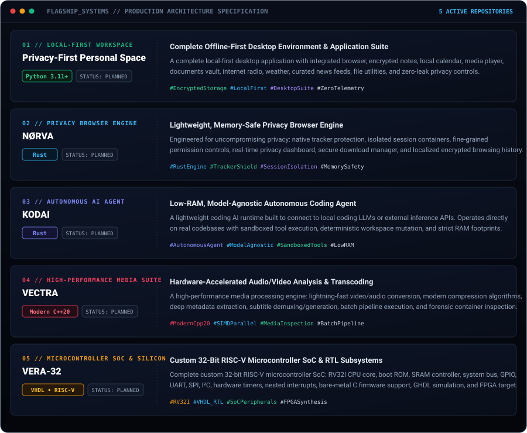

<!-- ===================================================================== -->
<!-- 1. LIVE SOLAR SYSTEM ANIMATED COMMAND DECK HERO                       -->
<!-- ===================================================================== -->

  

<!-- Interactive Web Desktop Launcher -->

  

 

<!-- ===================================================================== -->
<!-- 2. ANIMATED LIVE TERMINAL CONSOLE (ZERO TEXT OVERLAP)                 -->
<!-- ===================================================================== -->

  

<!-- ===================================================================== -->
<!-- 3. REAL LIVE GITHUB DAILY STREAK TRACKER                              -->
<!-- ===================================================================== -->

  

 

<!-- ===================================================================== -->
<!-- 4. FLAGSHIP SYSTEMS // INDIVIDUAL ENGINEERING MODULE CARDS            -->
<!-- (Pure Visual Architecture Deck — Zero Redundant Text Underneath)       -->
<!-- ===================================================================== -->

 

  

<!-- ===================================================================== -->
<!-- 5. CORE ENGINEERING ARSENAL // LANGUAGES, SILICON & RUNTIMES          -->
<!-- ===================================================================== -->

 

  
  &nbsp;&nbsp;
  
  &nbsp;&nbsp;
  
  &nbsp;&nbsp;
  
  &nbsp;&nbsp;
  
  &nbsp;&nbsp;
  

 

  <code>Rust</code> &nbsp;•&nbsp;
  <code>Modern C++20</code> &nbsp;•&nbsp;
  <code>Python 3.11+</code> &nbsp;•&nbsp;
  <code>VHDL</code> &nbsp;•&nbsp;
  <code>RISC-V Assembly (RV32I)</code> &nbsp;•&nbsp;
  <code>Bare-Metal C</code> &nbsp;•&nbsp;
  <code>FPGA Synthesis</code> &nbsp;•&nbsp;
  <code>SIMD (AVX2/NEON)</code> &nbsp;•&nbsp;
  <code>Encrypted SQLite</code> &nbsp;•&nbsp;
  <code>Linux Internals</code>

 

<!-- ===================================================================== -->
<!-- 6. VERIFIED ACADEMIC PEDIGREE // RESEARCH EXCELLENCE                 -->
<!-- ===================================================================== -->

 

  🎓 <b>Master of Science in Information Technology (M.Sc. IT)</b> — Mumbai University (<b>CGPA: 8.7</b>) 
  <i>Passed Inter-Collegiate Test for Final Year Project Grant</i>  
  🎓 <b>Bachelor of Science in Information Technology (B.Sc. IT)</b> — Mumbai University (<b>CGPA: 8.3</b>) 
  <i>Event Lead for Inter-Collegiate Tech Summit</i>

 

<!-- ===================================================================== -->
<!-- 7. CONTRIBUTION ACTIVITY STREAM                                       -->
<!-- ===================================================================== -->

 

<picture>
  <source media="(prefers-color-scheme: dark)" srcset="https://raw.githubusercontent.com/utkarsh-manoj-pandey/utkarsh-manoj-pandey/output/github-contribution-grid-snake-dark.svg" />
  <source media="(prefers-color-scheme: light)" srcset="https://raw.githubusercontent.com/utkarsh-manoj-pandey/utkarsh-manoj-pandey/output/github-contribution-grid-snake.svg" />
  
</picture>

  

<!-- ===================================================================== -->
<!-- 8. SECURE UPLINK // DIRECT COMMUNICATION CHANNELS                     -->
<!-- ===================================================================== -->

 

  <i>Open to technical discussions on silicon microarchitecture, systems engineering in Rust/C++, and autonomous agent runtimes.</i>

 

  
  &nbsp;&nbsp;
  
  &nbsp;&nbsp;
  
  &nbsp;&nbsp;
  

 

  <code>[ 2026 // UTKARSH MANOJ PANDEY // SYSTEMS &amp; SILICON LAB // ACTIVE ]</code>

